# Experiment 10 C^D
##SONARQUBE

## Step 1: Create Docker Network
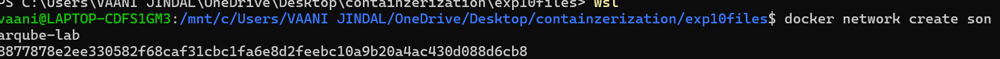

---

## Step 2: Start PostgreSQL Database
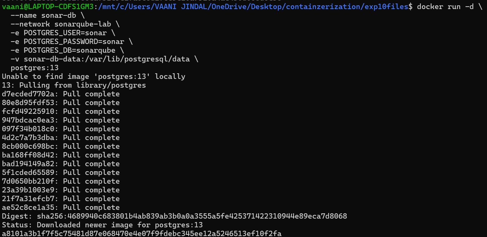

---

## Step 3: Start SonarQube Server
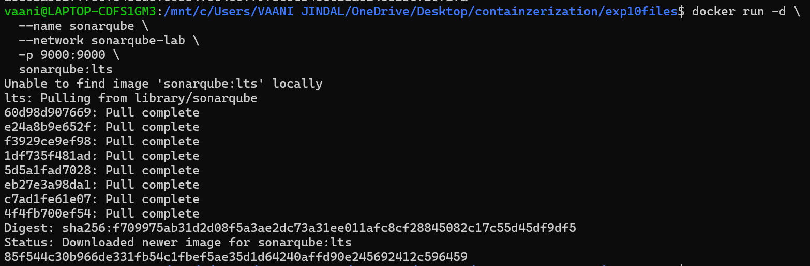

---

## Step 4: Generate Token (IMPORTANT)

Inside SonarQube UI:

1. Go to My Account → Security  
2. Click Generate Token  
3. Copy it  

---

## Step 5: Create Sample Project
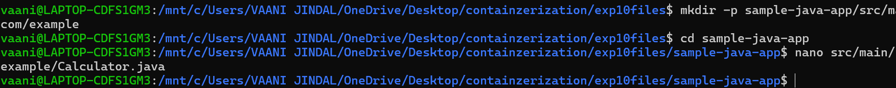
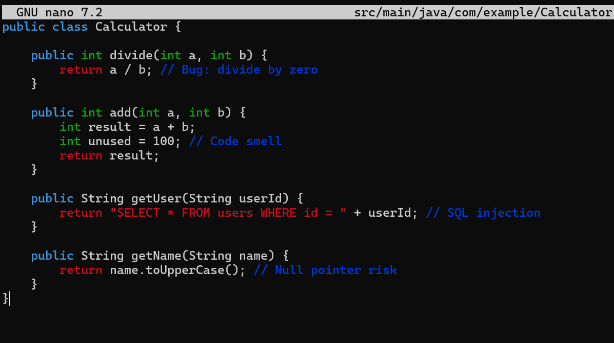

---

## Step 6: Create Sonar Config File and Run Sonar Scanner (Docker way)
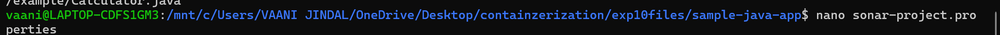
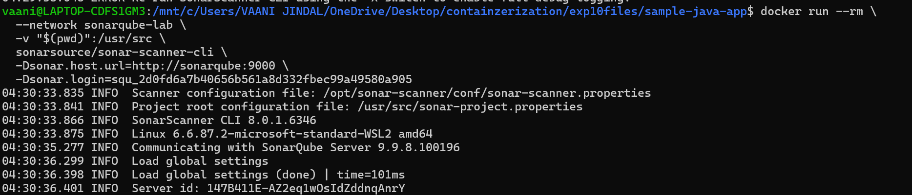
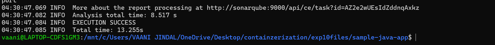

---

## Step 8: View Results

Go to:  
👉 http://localhost:9000  
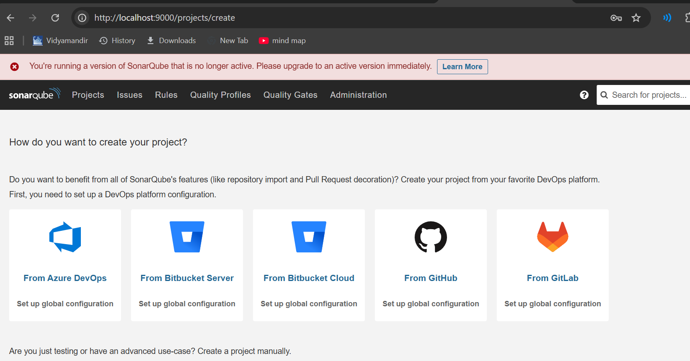
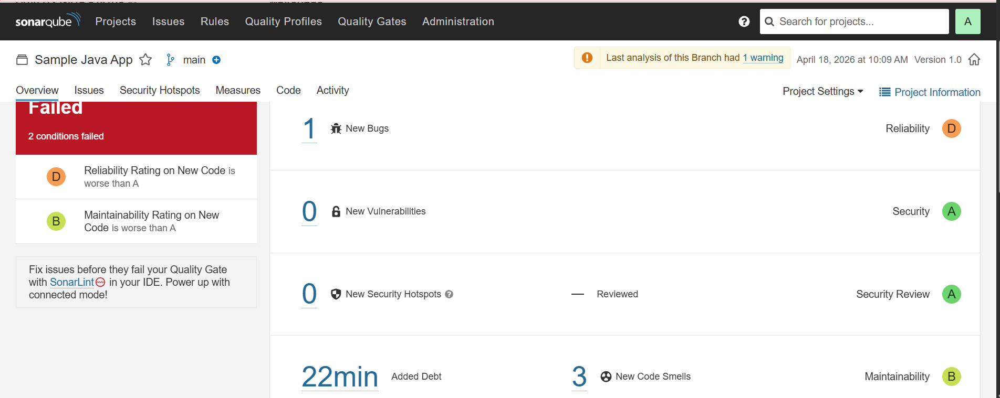
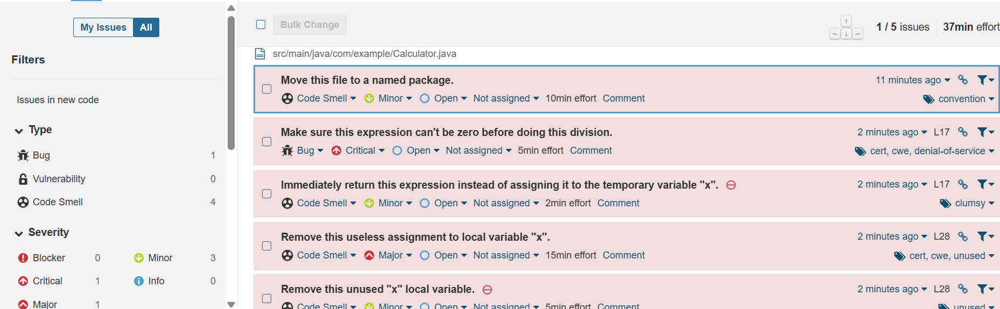
