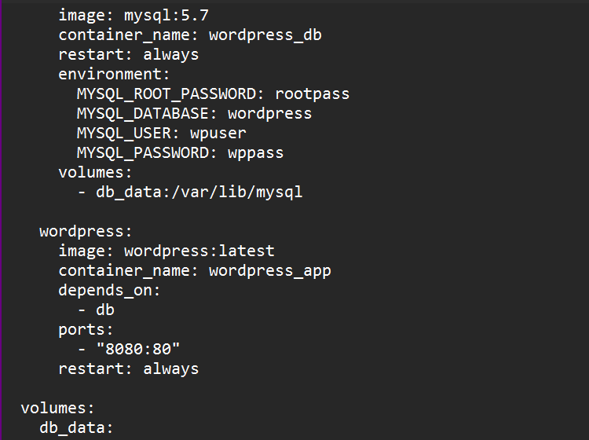
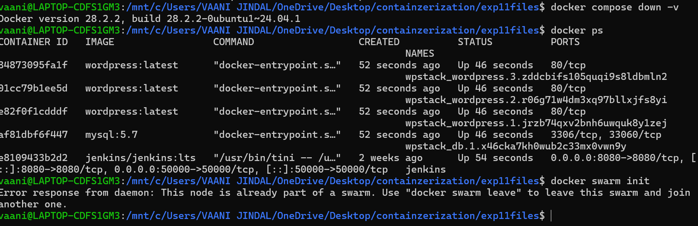
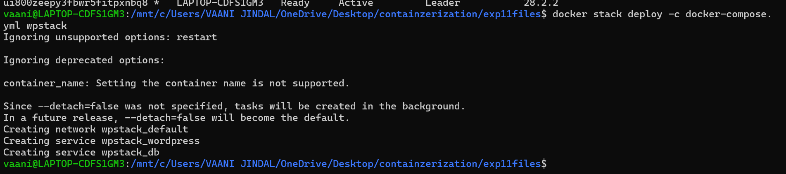
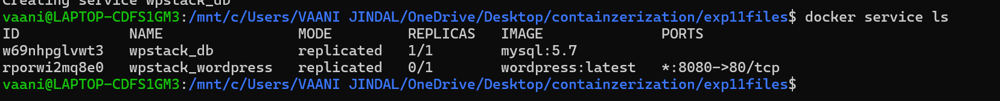
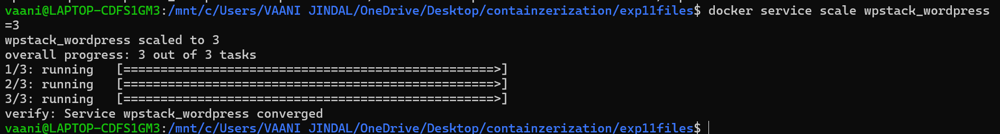
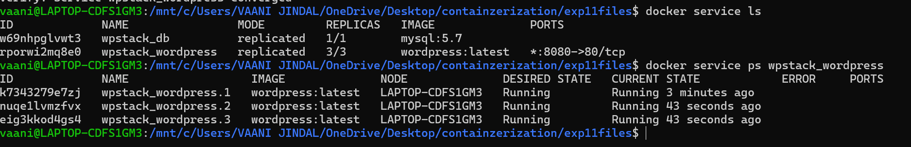
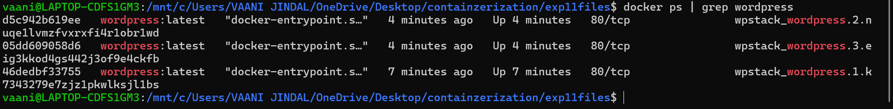
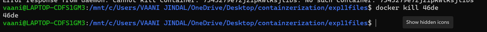
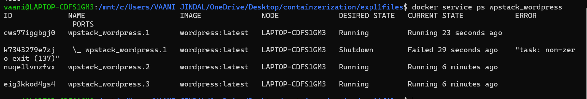
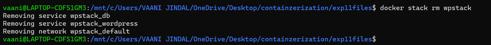

# EXPERIMENT -11

---

## PART A –

### 1. Run single container  
**Command :**
```bash
docker run nginx
```
Runs only one container manually  
No coordination between multiple containers  

---

### 2. Run multi-container using Compose  
**Command :**
```bash
docker compose up -d
```
Runs multiple containers together (WordPress + MySQL)  
Works only on single machine, no scaling/self-healing  

---

## PART B –

### Step 0: docker-compose.yml



---

## Task 1: Check Current State (No Swarm)

```bash
docker compose down -v
docker ps
```



---

## Task 2: Initialize Docker Swarm

```bash
docker swarm init
```



---

## Task 3: Deploy as Stack

```bash
docker stack deploy -c docker-compose.yml wpstack
```



---

## Task 4: Verify Deployment

```bash
docker service ls
```



---

## Task 5: Access Application

Open in browser:
```
http://localhost:8080
```

---

## Task 6: Scaling (MAIN FEATURE)

```bash
docker service scale wpstack_wordpress=3
```



---

### Verify and check running :

```bash
docker service ls
docker service ps wpstack_wordpress
```



---

## Task 7: Self-Healing Test

### Step 1: Find container
```bash
docker ps | grep wordpress
```



---

### Step 2: Kill one container
```bash
docker kill <container-id>
```



---

### Step 3: Check again
```bash
docker service ps wpstack_wordpress
```



---

## Task 8: Remove Stack

```bash
docker stack rm wpstack
```

---

## PART C – ANALYSIS (WRITE IN EXAM)

| Feature | Docker Compose | Docker Swarm |
|--------|---------------|--------------|
| Scope | Single machine | Cluster (multi-node) |
| Scaling | Manual (--scale) | Built-in |
| Load Balancing | No | Yes |
| Self-Healing | No | Yes |

---
