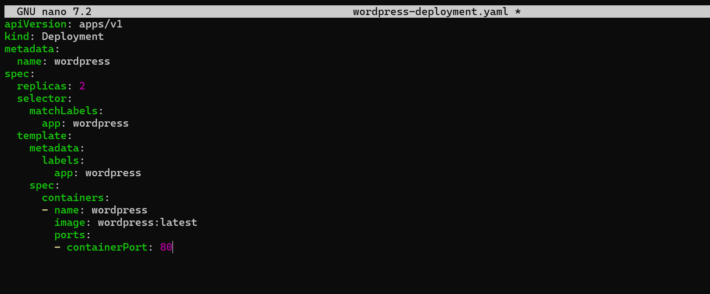
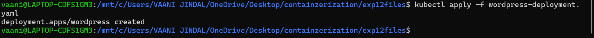
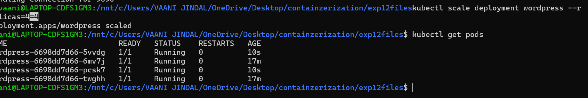
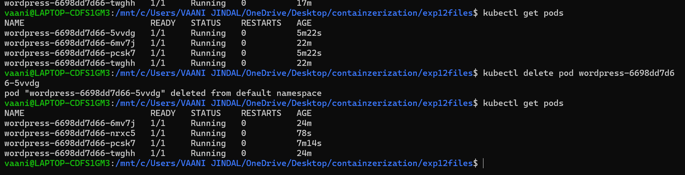

# EXPERIMENT 12

---

# PART A – CONCEPT (SHORT + WRITEABLE)

## 🔹 Objective

- Understand Kubernetes basics  
- Deploy application  
- Scale application  
- Perform self-healing  

---

## 🔹 Why Kubernetes over Docker Swarm?

| Reason | Explanation |
|--------|------------|
| Industry standard | Most companies use Kubernetes |
| Powerful scheduling | Automatically decides where to run apps |
| Large ecosystem | Many tools/plugins |
| Cloud-native support | Works on AWS, GCP, Azure |

---

# PART B –

---

## Step 1: Create file



### wordpress-deployment.yaml

```yaml
apiVersion: apps/v1
kind: Deployment
metadata:
  name: wordpress
spec:
  replicas: 2
  selector:
    matchLabels:
      app: wordpress
  template:
    metadata:
      labels:
        app: wordpress
    spec:
      containers:
      - name: wordpress
        image: wordpress:latest
        ports:
        - containerPort: 80
```

---

## Step 2: Apply deployment



```bash
kubectl apply -f wordpress-deployment.yaml
```

---

## Task: Scaling



```bash
kubectl scale deployment wordpress --replicas=4
kubectl get pods
```

---

## TASK 5: self healing scaling



```bash
# Get pods
kubectl get pods

# Delete one pod
kubectl delete pod <pod-name>

# Check again
kubectl get pods
```

---

# PART C – Swarm vs Kubernetes (Simple Comparison)

| Feature | Docker Swarm | Kubernetes |
|--------|-------------|------------|
| Setup | Very easy | More complex |
| Scaling | Basic | Advanced (auto-scaling) |
| Ecosystem | Small | Huge (monitoring, logging) |
| Industry use | Rare | Standard |

---

# ✅ Conclusion

- Kubernetes helps manage containerized applications efficiently  
- It supports scaling and self-healing automatically  
- It is widely used in industry compared to Docker Swarm  

---


