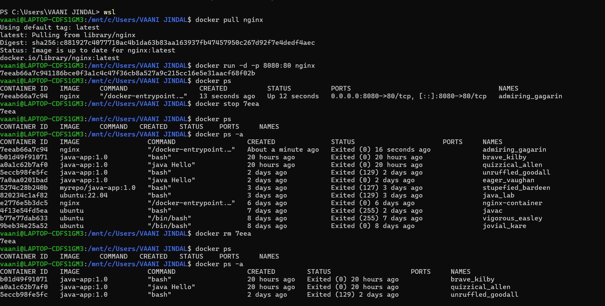
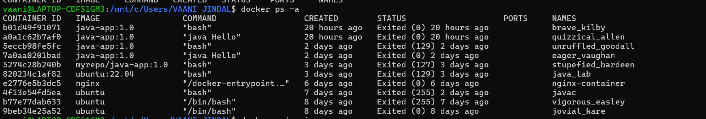
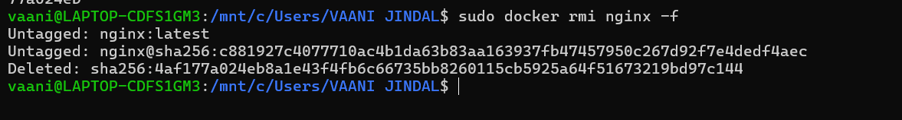

# Experiment 2: Docker Image and Container Lifecycle

---

## Student Details

- **Name:** Vaani Jindal  
- **SAP ID:** 500119144  
- **Batch:** 2 CCVT  

---

## Objective

To pull Docker images, run containers, and perform basic container lifecycle operations.

---

## Experiment Setup – Part B: Docker Container Management

---

### Step 1: Pull Docker Image

Download the Nginx Docker image from Docker Hub to the local system.

---

### Step 2: Run Container with Port Mapping

Create and run a Docker container using the Nginx image with proper port mapping.

---

### Step 3: Verify Running Containers

Check the list of active Docker containers to confirm that the container is running.

---

### Step 4: Stop and Remove Container

Stop the running container and remove it from the system.

---

### Step 5: Remove Docker Image

Delete the Nginx Docker image from the local system.

---

### Step 6: Re-run Container After Image Deletion

After deleting the image, try running the container again to check whether Docker downloads the image automatically.

---

### Step 7: Verify Container on Localhost

Check the localhost port to verify that the Nginx server is running properly.

---

## Observation

- The Docker image was successfully pulled.
- The container was created and executed properly.
- Port mapping allowed access through the browser.
- After deleting the image, Docker downloaded it again automatically.
- Container lifecycle commands worked as expected.

---

## Conclusion

In this experiment, Docker images were pulled successfully and containers were executed.

Basic lifecycle operations such as starting, stopping, removing containers, and deleting images were performed.

This experiment helped in understanding how Docker manages containers and images efficiently.

---
