# 🧪 Experiment 3: Deploying Nginx Using Docker

---

## 📌 Objective
To deploy and verify Nginx using:
- Official Docker Image  
- Custom Ubuntu Base Image  
- Custom Alpine Base Image  

---

# 🔹 Part 1: Deploy Nginx Using Official Image

### Step 1: Pull the Official Nginx Image
Download the official Nginx image from Docker Hub.

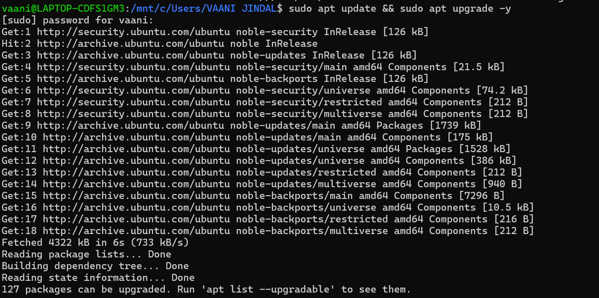
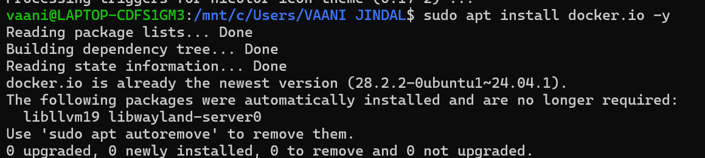
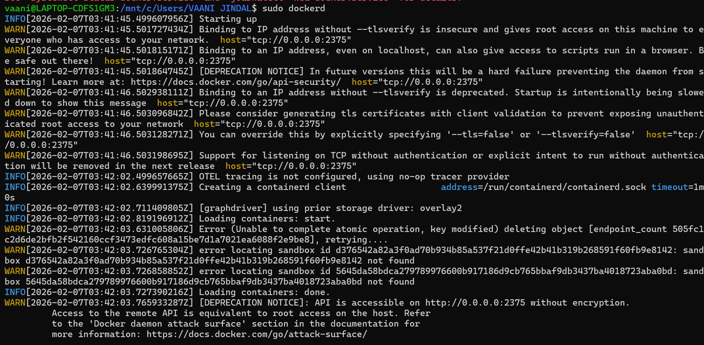
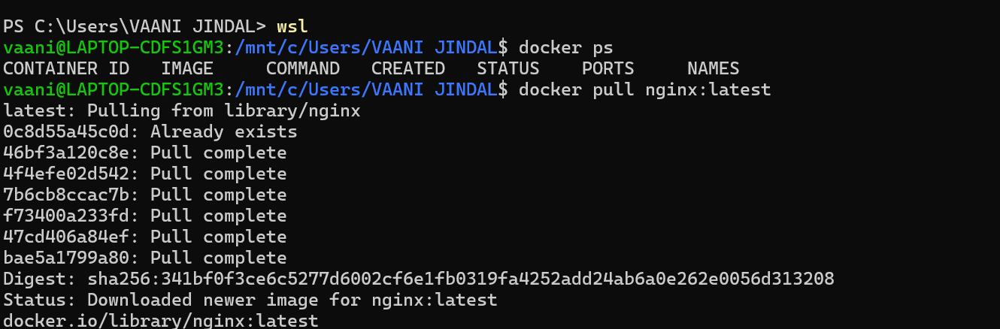

---

### Step 2: Run the Container
Start a container using the downloaded image.

---

### Step 3: Verify Deployment
Open the browser and check whether the Nginx welcome page is displayed.

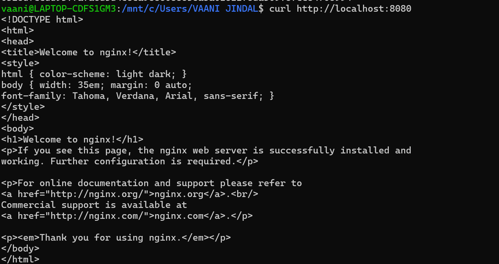

---

### Step 4: Check Container Status
Verify that the container is running successfully.

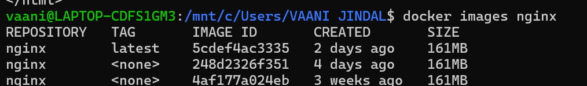

---

# 🔹 Part 2: Custom Nginx Using Ubuntu Base Image

### Step 1: Create Dockerfile
Create a Dockerfile using Ubuntu as the base image and install Nginx in it.

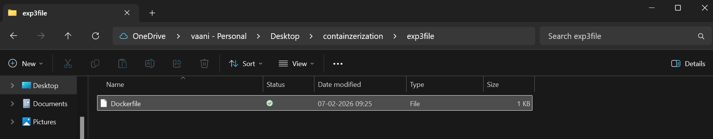
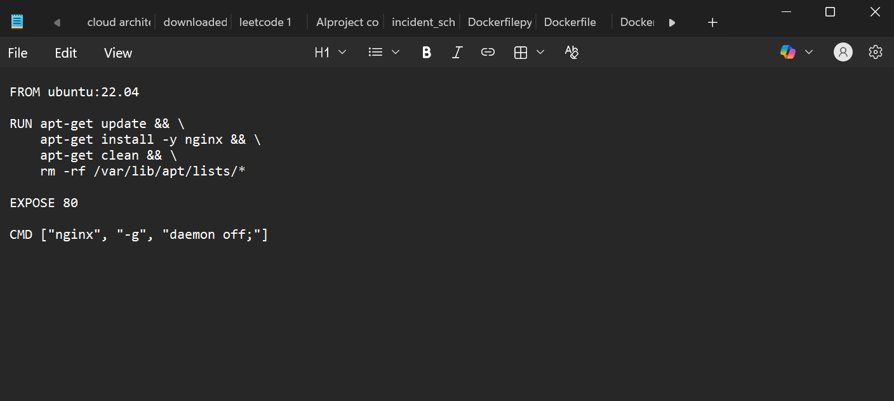

---

### Step 2: Build Custom Image
Build a Docker image using the created Dockerfile.

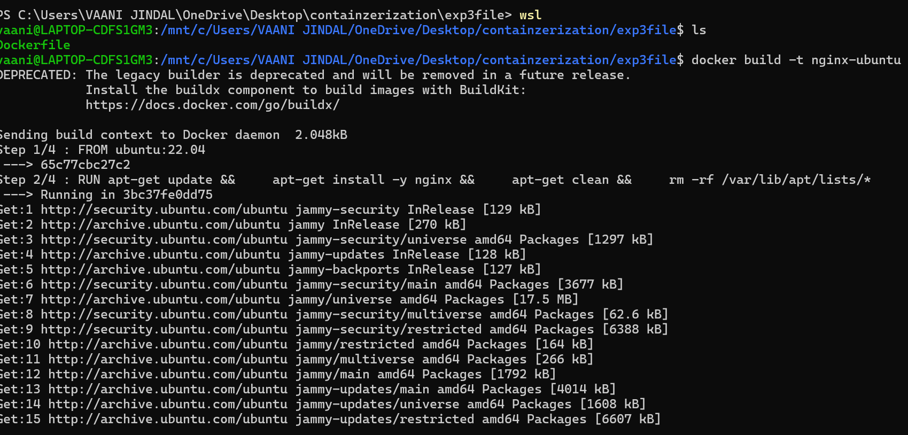

---

### Step 3: Run the Container
Start a container using the custom Ubuntu-based image.

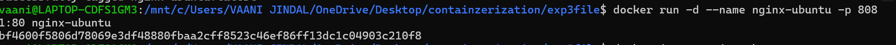

---

### Step 4: Verify Output
Check the Nginx webpage in the browser.

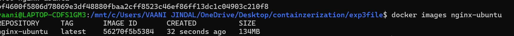

---

# 🔹 Part 3: Custom Nginx Using Alpine Base Image

### Step 1: Create Dockerfile
Create a Dockerfile using Alpine Linux as the base image and install Nginx.

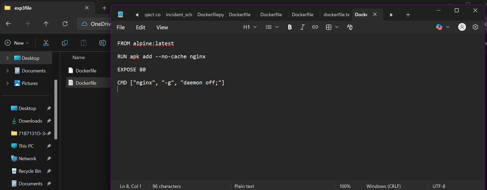

---

### Step 2: Build Image
Build the Docker image using the Alpine-based Dockerfile.

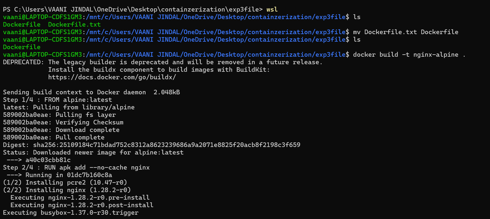

---

### Step 3: Run Container
Run a container using the newly created Alpine-based image.

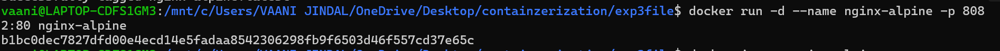

---

### Step 4: Verify Deployment
Open the browser and verify the Nginx welcome page.

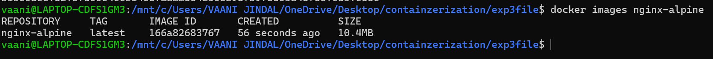

---

# ✅ Result
Nginx was successfully deployed using:
- Official Docker Image  
- Ubuntu Base Image  
- Alpine Base Image  

All containers were verified through browser testing.

---

# 📚 Conclusion

This experiment demonstrated the deployment of Nginx using different Docker images and base operating systems.

From the comparison, it is observed that:

- The **Ubuntu-based image** has the largest size due to more built-in packages.
- The **Official Nginx image** provides a balance between size and usability.
- The **Alpine-based image** is the smallest and most efficient.

Therefore, Alpine-based images are preferred for lightweight and production environments, while Ubuntu-based images are useful for development and debugging purposes.

---

