# 🧪 Experiment 4: Docker Essentials

---

# PART A: Containerizing Applications with Dockerfile

## Step 1: Create Simple Flask App
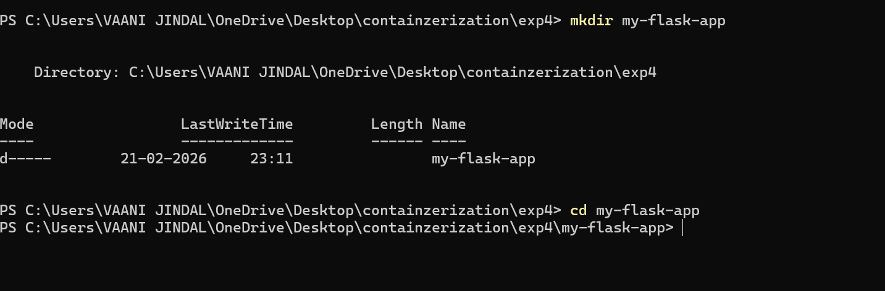
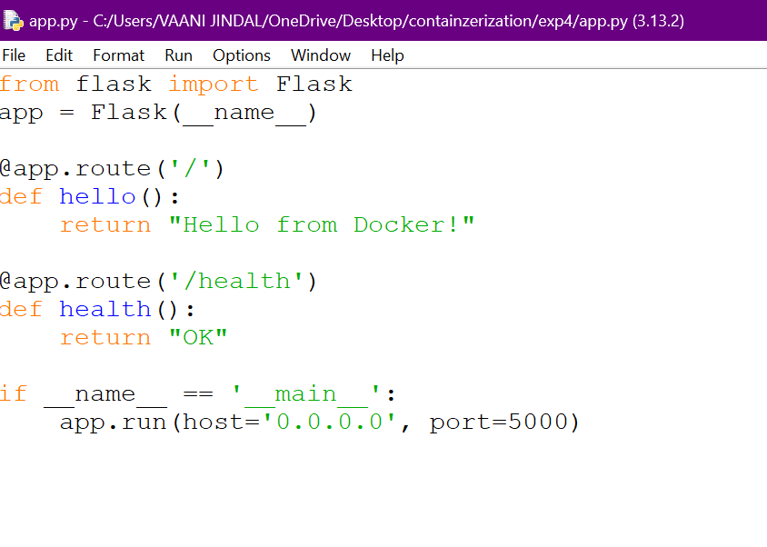

This screenshot shows the creation of a simple Flask application.

---

## Step 2: Create Dockerfile
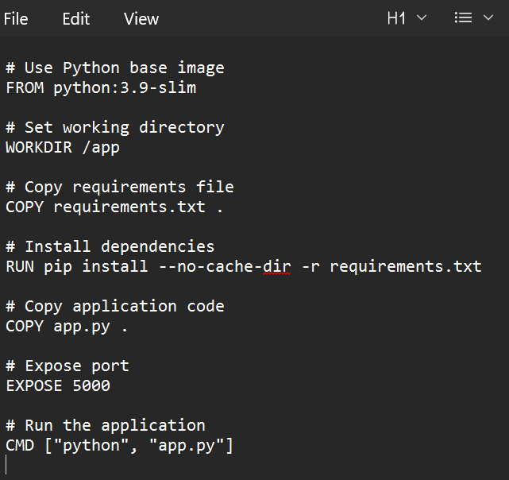

This Dockerfile is used to containerize the Flask application.

---

# PART 2: Using .dockerignore

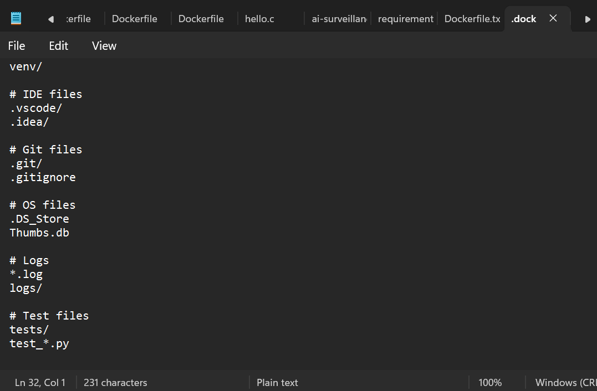

The `.dockerignore` file is used to exclude unnecessary files from the Docker build context.

---

# PART 3:

## Step 1: Basic Build Command

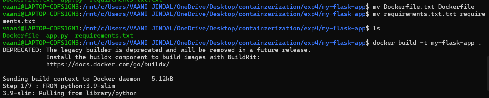
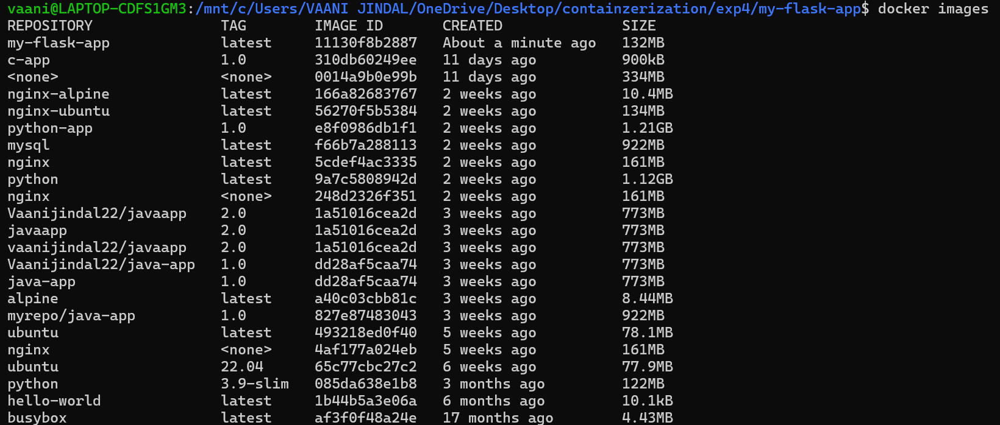

This shows the `docker build` command used to create a Docker image.

---

## Step 2: Tagging Image
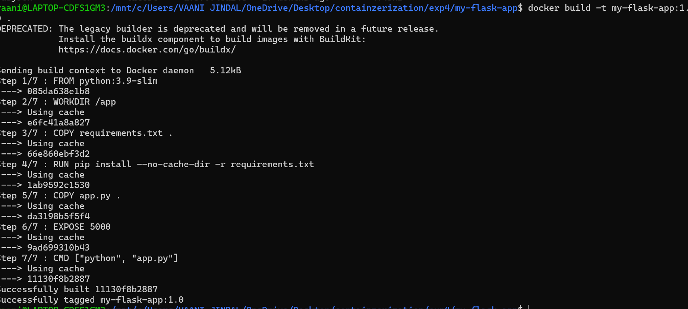

This shows how Docker images are tagged.

---

### Multiple Tags:
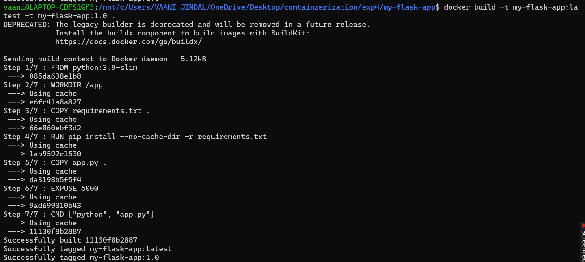

Assigning multiple tags to the same image.

---

### Tag with Custom Registry:
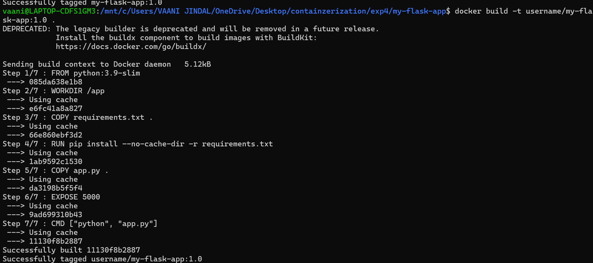

Tagging image with a custom registry name.

---

### Tag Existing Image:
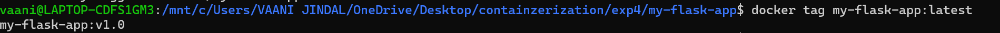

Tagging an already built Docker image.

---

## Step 3: View Image Details

### Show Image History
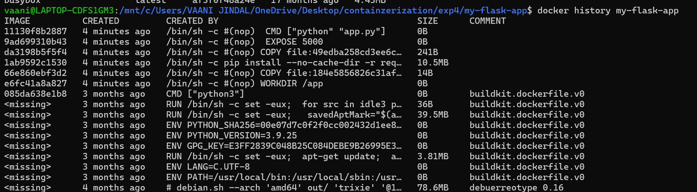

Displays the image layer history.

---

### Inspect Image Details
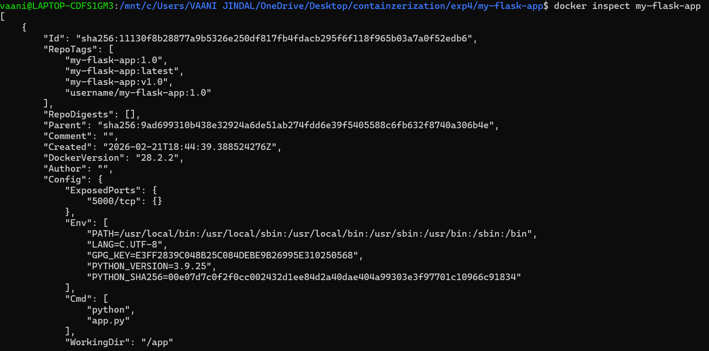

Shows detailed metadata of the Docker image.

---

# PART 4: Running Containers

## Step 1: Run Container
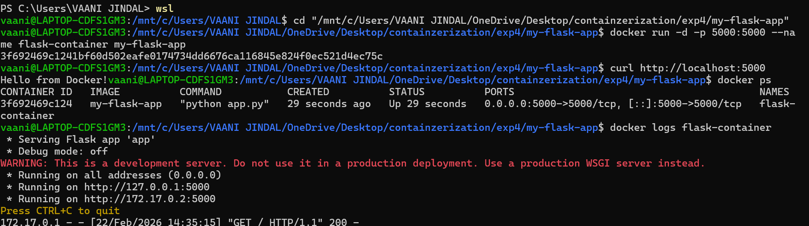

This screenshot shows how to run a Docker container.

---

## Step 2: Manage Container
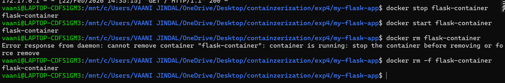

Commands used to manage running containers.

---

# PART 5: Multistage Builds

## Step: Simple Multistage Dockerfile
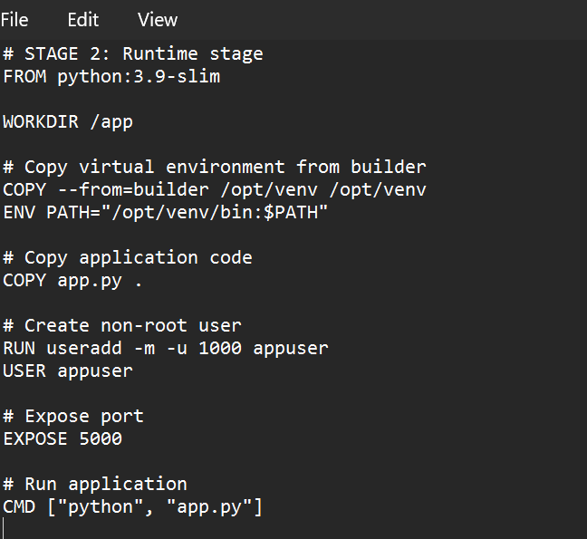

This shows a multistage Dockerfile.

---

## Step 3: Build and Compare
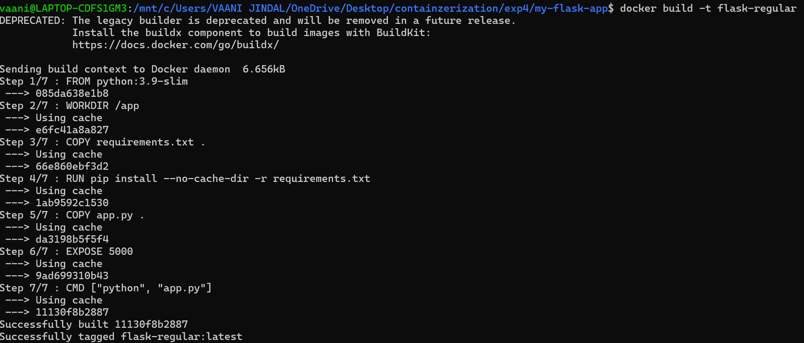

Building multistage Docker image.

---

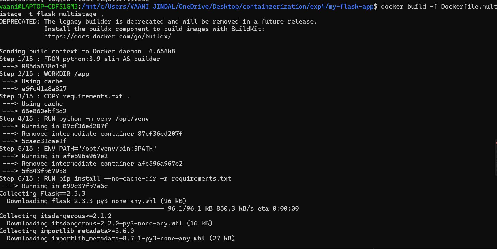
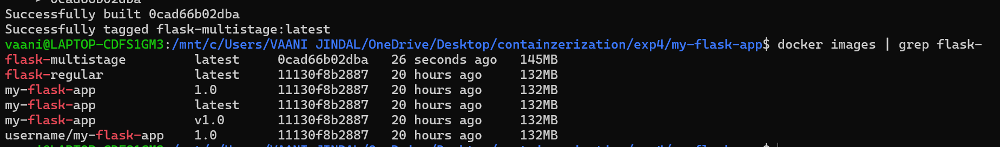

Comparison between normal and multistage image sizes.

---

# PART 6: Publishing to Docker Hub

## Step 1: Prepare for Publishing
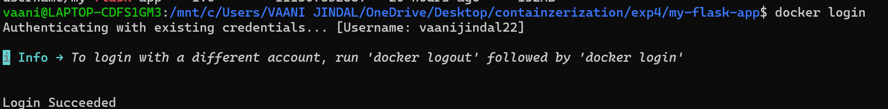
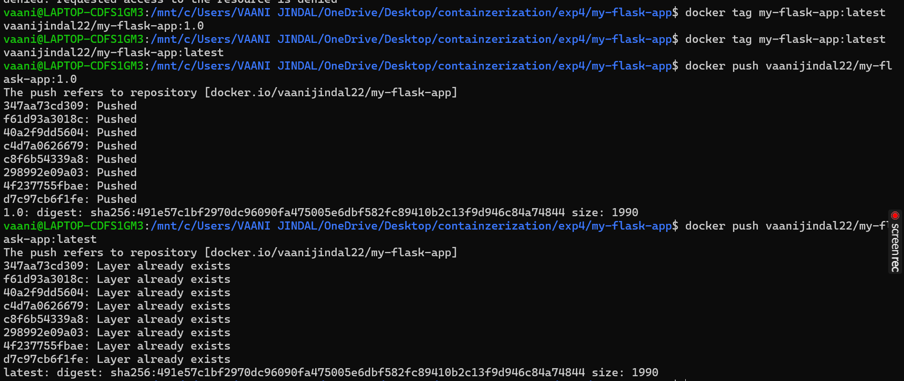

Login to Docker Hub before pushing images.

---

## Step 2: Pull and Run from Docker Hub
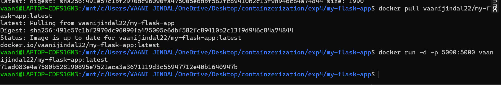

# PART 7: Node.js Example

## Step 1: Node.js Application
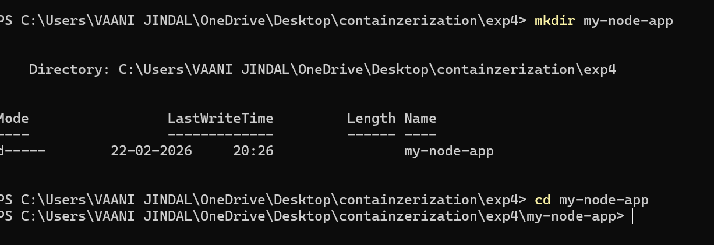

Shows Node.js project structure.

##step 2: Create app.js, package.json, Node.js Dockerfile

Displays Node.js application files.
## step 3: build and run
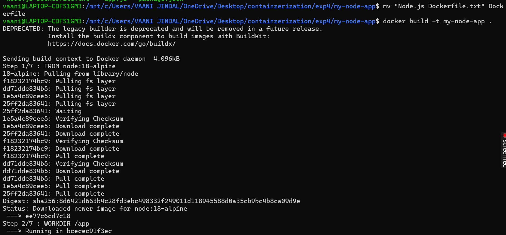
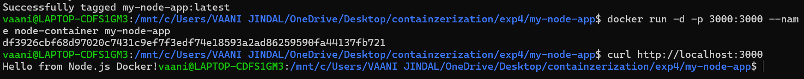
Successful execution of Node.js container.

