# Experiment 6

---

# Part A
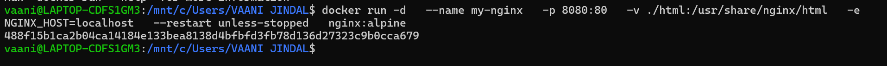

---

# Part B

## Task 1: Run nginx using docker run


### Output Screenshot

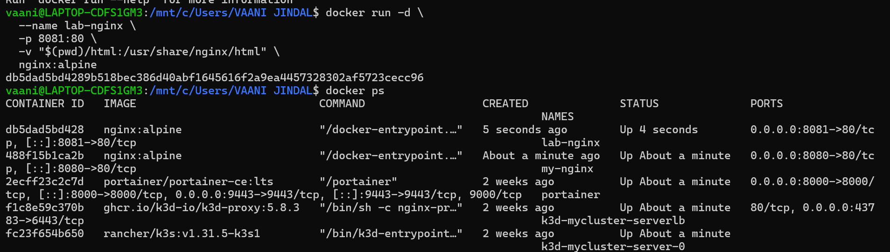

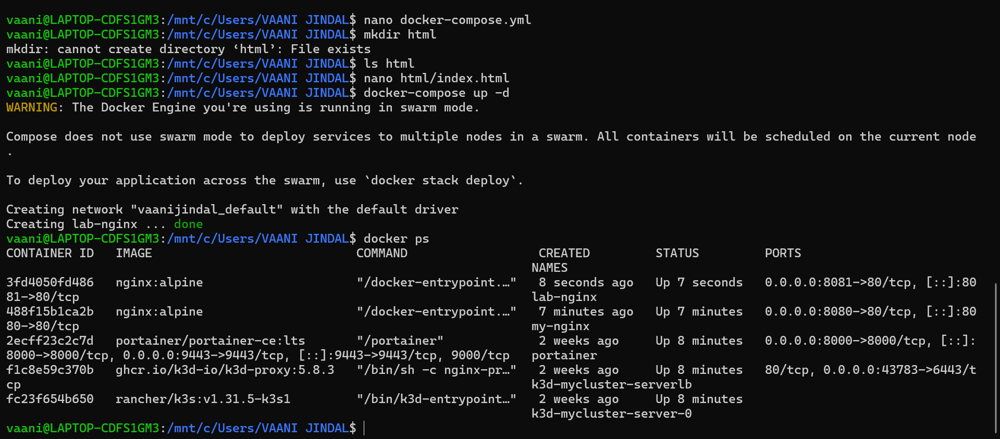
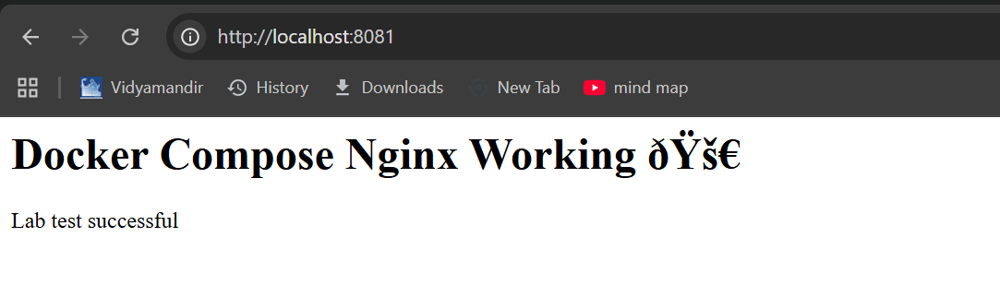


---

## Task 2: Multi Container Application

### Create Network


### Run Container 1

### Run Container 2


### Screenshots

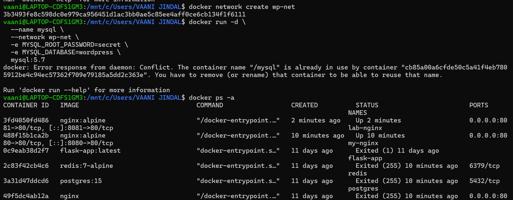

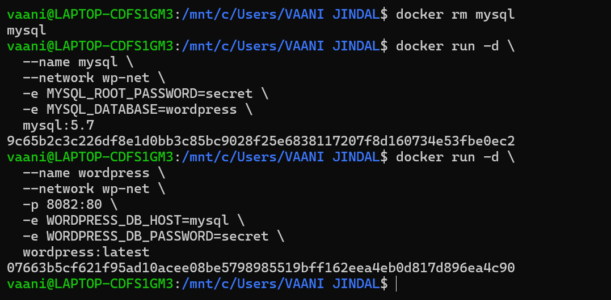

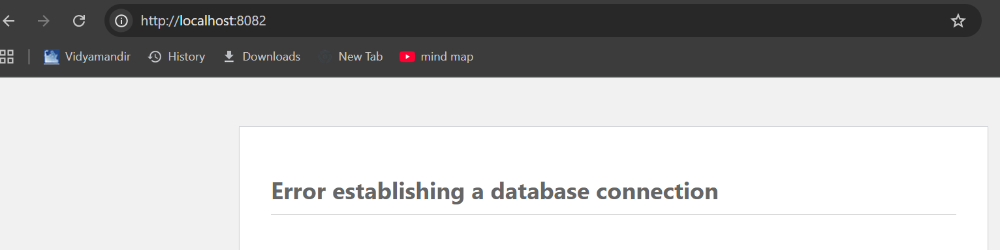

---

# Part C

## Task 3: Convert docker run to docker compose

### docker-compose.yml

```yaml
version: '3'
services:
  nginx:
    image: nginx
    ports:
      - "8080:80"
```

### Run Command

```bash
docker-compose up -d
```

### Screenshot

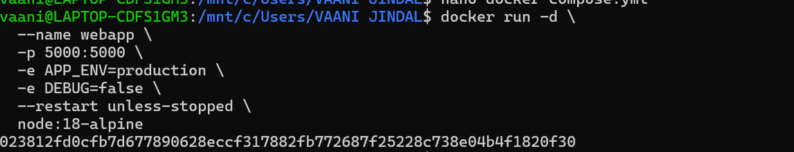
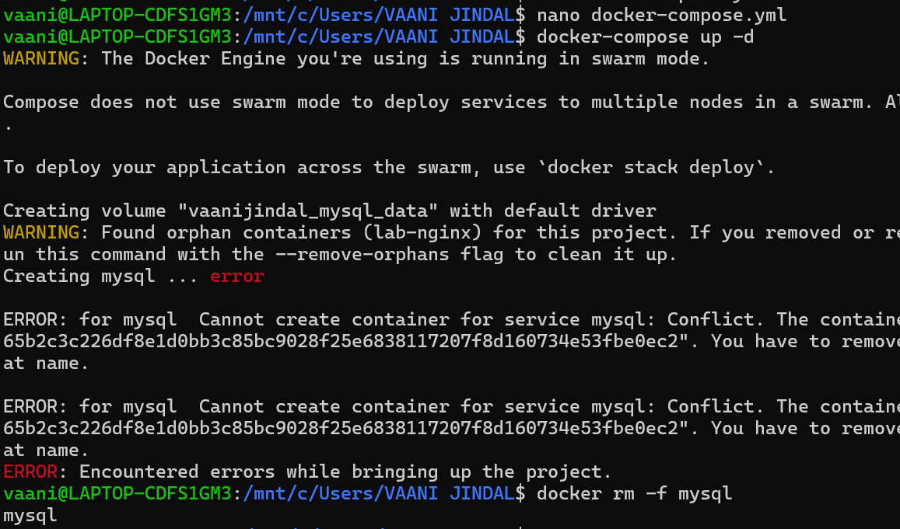
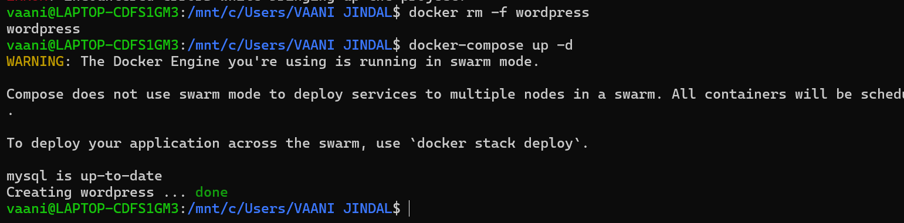
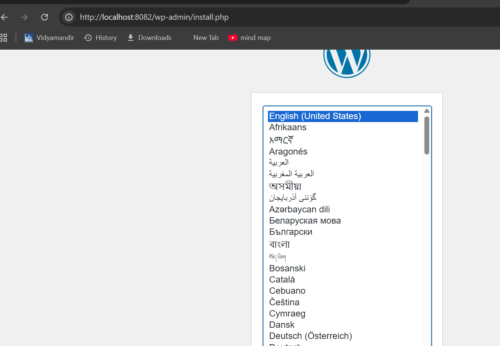


---

## Task 4: Resource Limit Conversion

### docker-compose.yml

```yaml
version: '3'
services:
  nginx:
    image: nginx
    deploy:
      resources:
        limits:
          cpus: "0.5"
          memory: 512M
```

### Screenshot

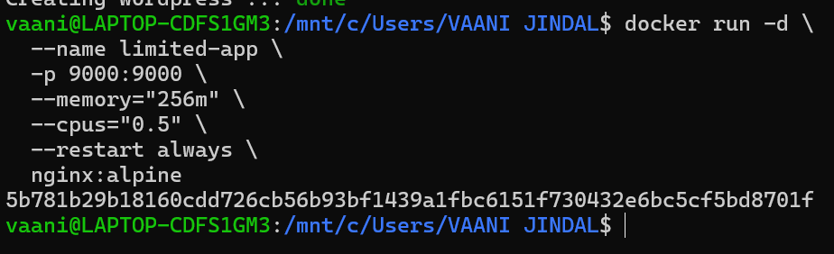

---

# Part D : Using Dockerfile Instead of Image

## Task 5

### Dockerfile

```dockerfile
FROM nginx
COPY index.html /usr/share/nginx/html/index.html
```

### Build Image

```bash
docker build -t custom-nginx .
```

### Run Container

```bash
docker run -d -p 8080:80 custom-nginx
```

### Screenshot

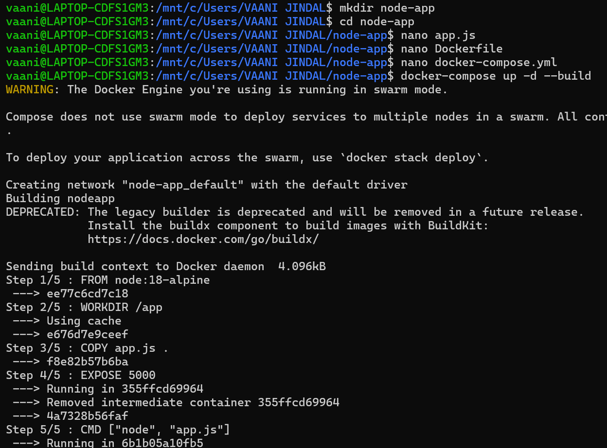
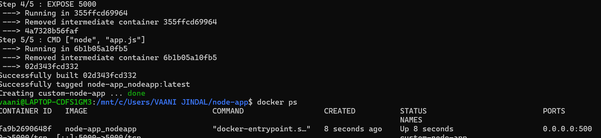
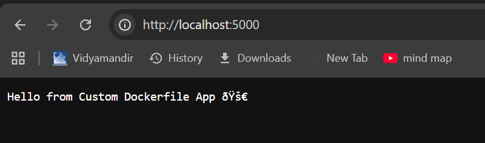

---

## Task 6: Multistage Dockerfile with Compose

### Multi-stage Dockerfile

```dockerfile
FROM node:16 as build

WORKDIR /app

COPY package*.json ./

RUN npm install

COPY . .

RUN npm run build

FROM nginx

COPY --from=build /app/build /usr/share/nginx/html
```

---

### docker-compose.yml

```yaml
version: '3'

services:
  web:
    build: .
    ports:
      - "8080:80"
```

### Run

```bash
docker-compose up --build
```

### Screenshots

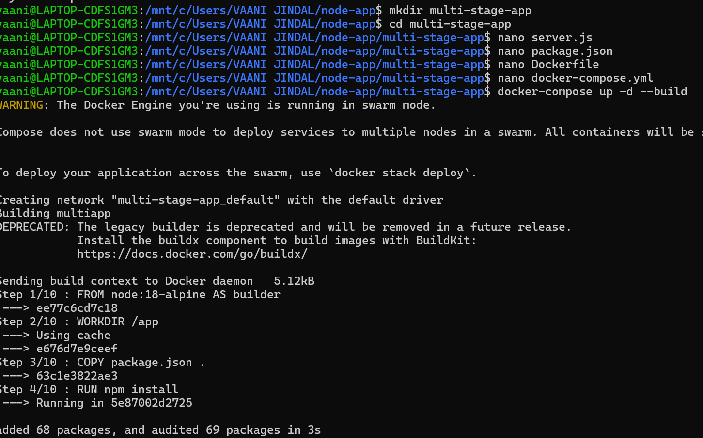

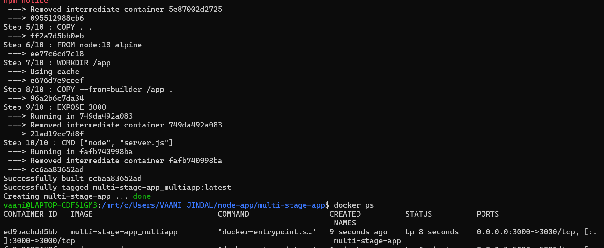

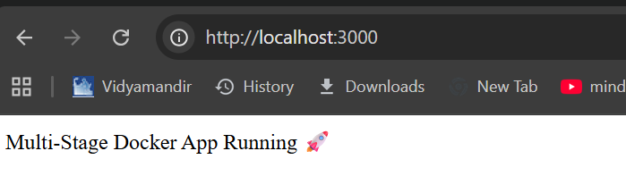

---

# Experiment 6B

# Multi Container Application using Docker Compose

### docker-compose.yml

```yaml
version: '3'

services:
  web:
    image: nginx
    ports:
      - "8080:80"

  db:
    image: mysql
    environment:
      MYSQL_ROOT_PASSWORD: root
```

### Run

```bash
docker-compose up -d
```

### Screenshot

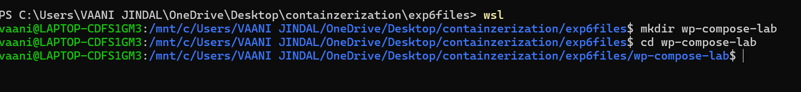
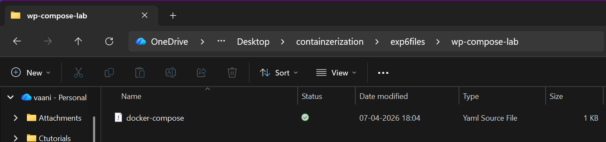
!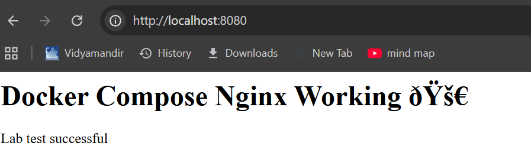
[Task1 Output](images/exp6/w.png)
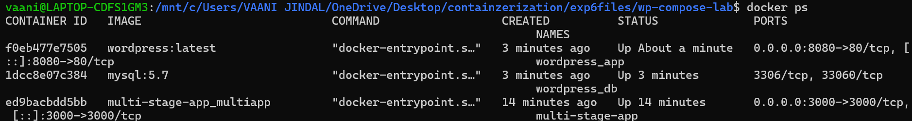
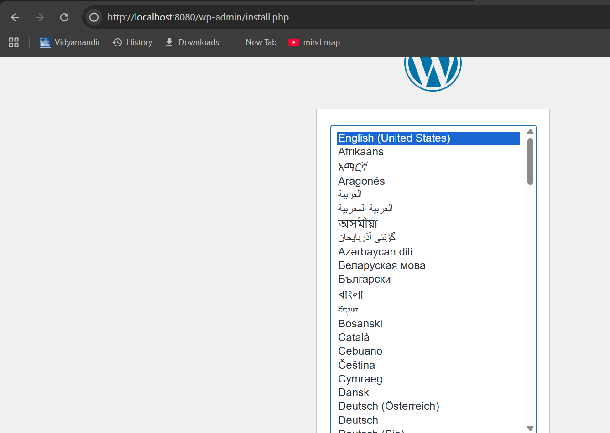
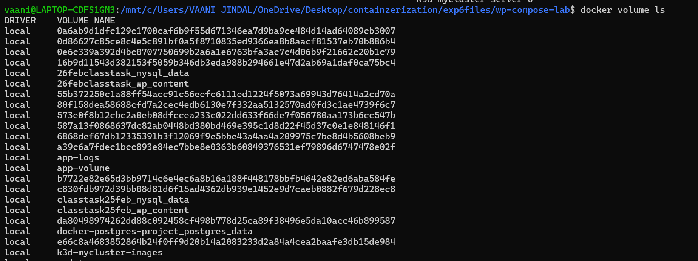
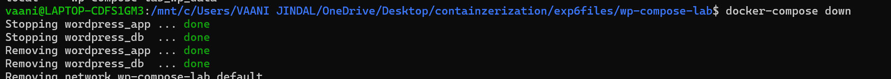
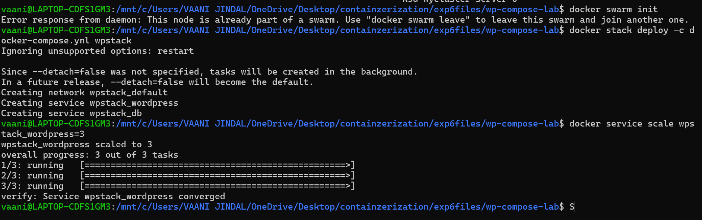

---

# Result

Successfully performed:

- Running nginx using docker run
- Multi container application
- Converting docker run to docker compose
- Resource limit conversion
- Using Dockerfile instead of image
- Multi-stage Dockerfile with compose
- Multi container application using docker compose

Experiment completed successfully.
