# Experiment 7

---

# Part A:

In this part, a CI/CD pipeline setup was planned using GitHub repository for storing application source code.  
A Flask based application was prepared and pushed to GitHub repository for further automation using Jenkins.

The repository was created and project files were uploaded successfully.  
The application structure was verified and repository connection was confirmed.

### Screenshots

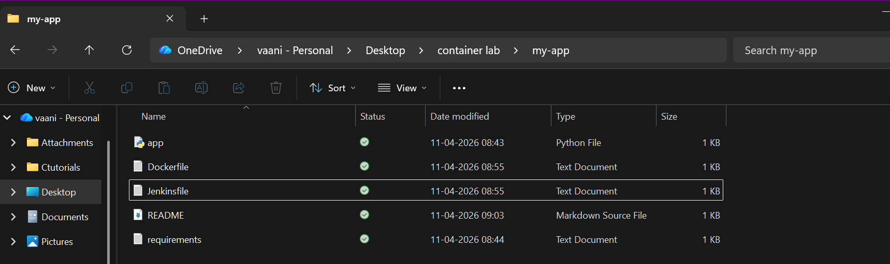
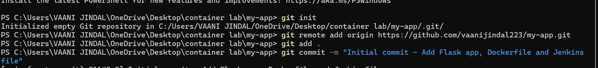
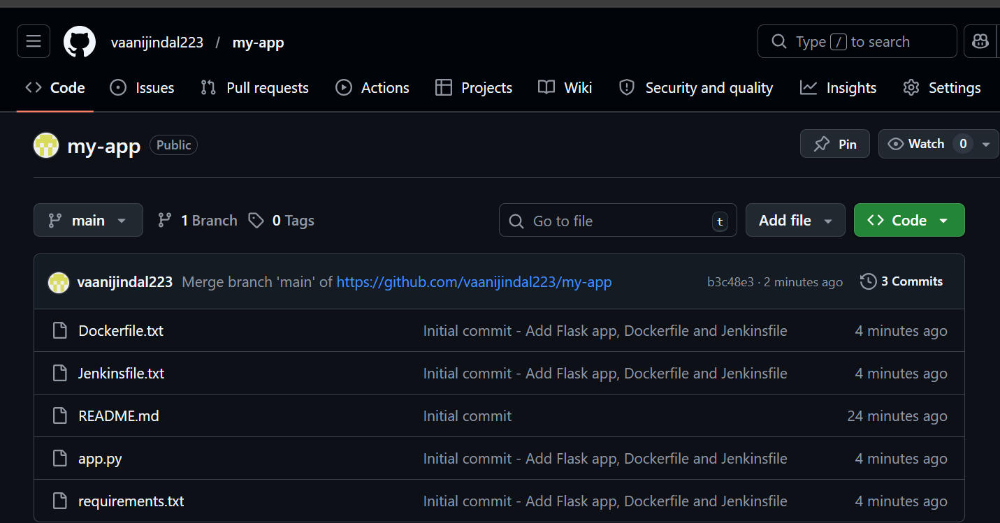

---

# Part B:

In this part, Docker containerization was implemented for the application.  
Docker image was created using Dockerfile and application dependencies were installed.

Docker container was executed successfully and application was verified using browser.

Docker environment setup was completed successfully and container execution was verified.

### Screenshots

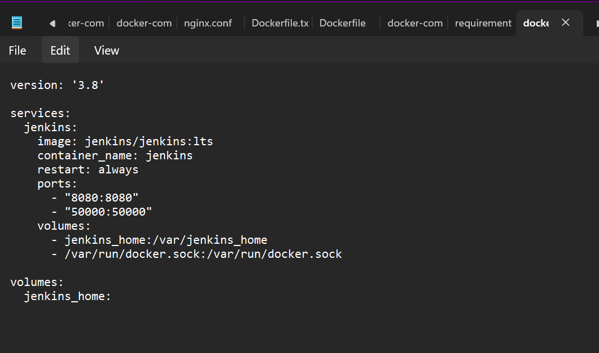
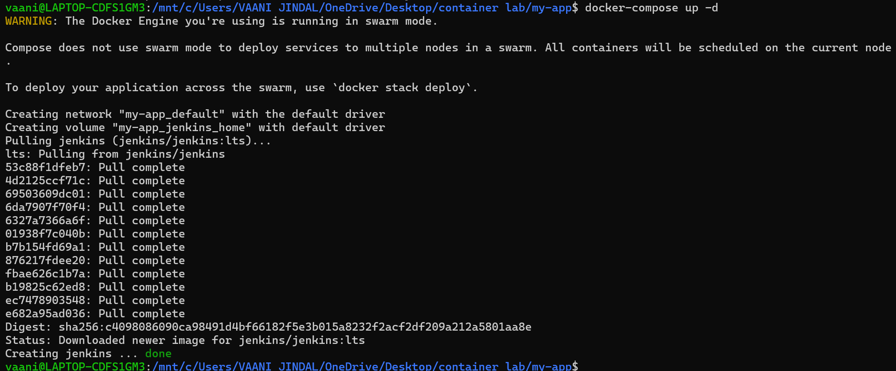
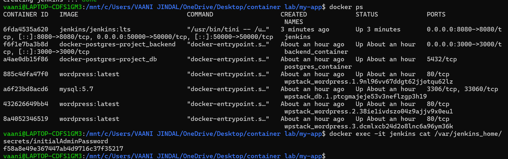
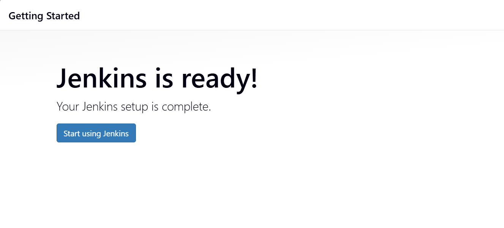
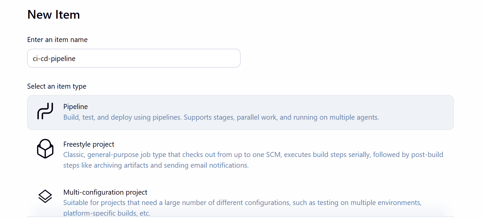
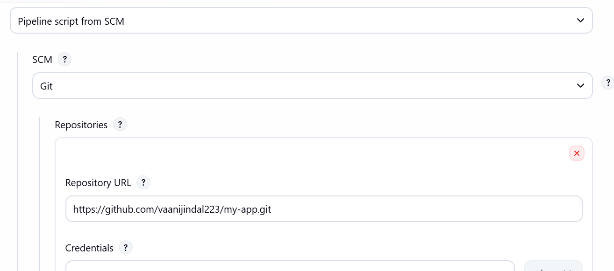

---

# Part C:

In this part, Jenkins pipeline configuration was created.  
Jenkinsfile was prepared for automating CI/CD workflow.

Pipeline stages included:

- Clone Source
- Build Docker Image
- Login to DockerHub
- Push Docker Image

Jenkins pipeline job was created and GitHub repository was connected successfully.

### Screenshots

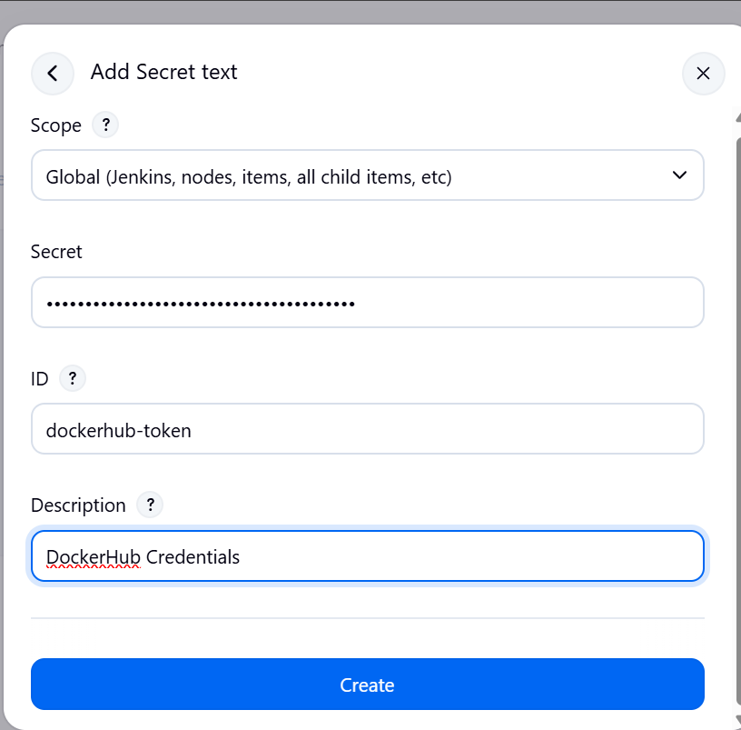
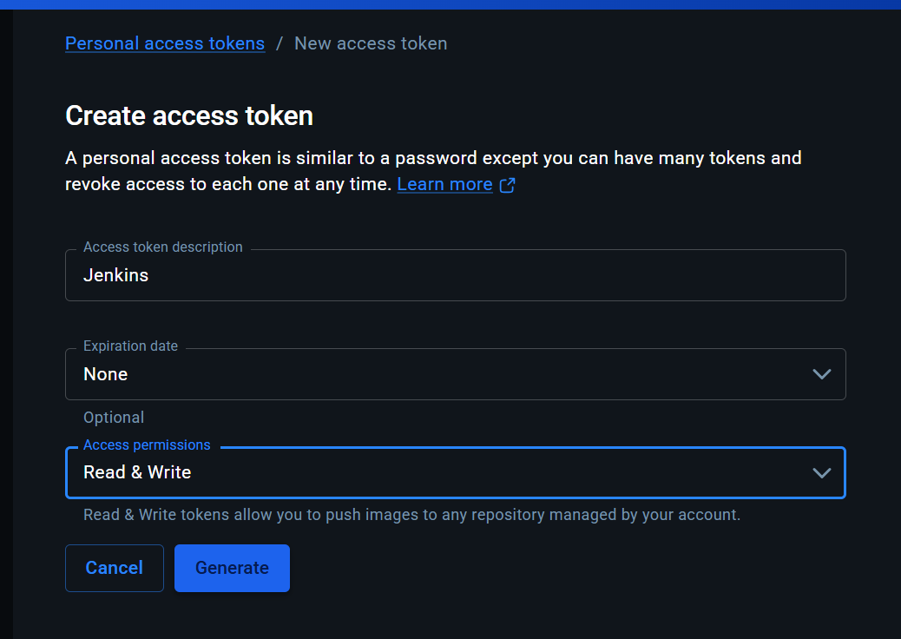

---

# Part D:

In this part, Jenkins server was deployed using Docker container.  
Jenkins container was started successfully and accessed using browser.

Jenkins initial setup was completed and required plugins were installed.

Docker socket was mounted to allow Jenkins to access Docker daemon.

Jenkins environment setup was completed successfully.

### Screenshots

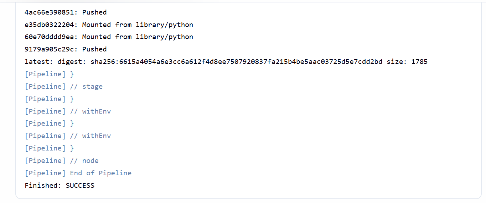

---

# Part E:

In this part, DockerHub credentials were configured inside Jenkins.  
Pipeline job execution was triggered and CI/CD workflow executed successfully.

Pipeline executed following stages:

- Clone Source
- Build Docker Image
- Login DockerHub
- Push Docker Image

Docker image was successfully pushed to DockerHub repository.

### Screenshots

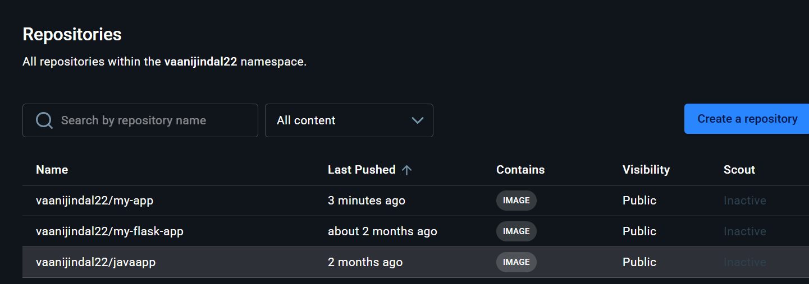
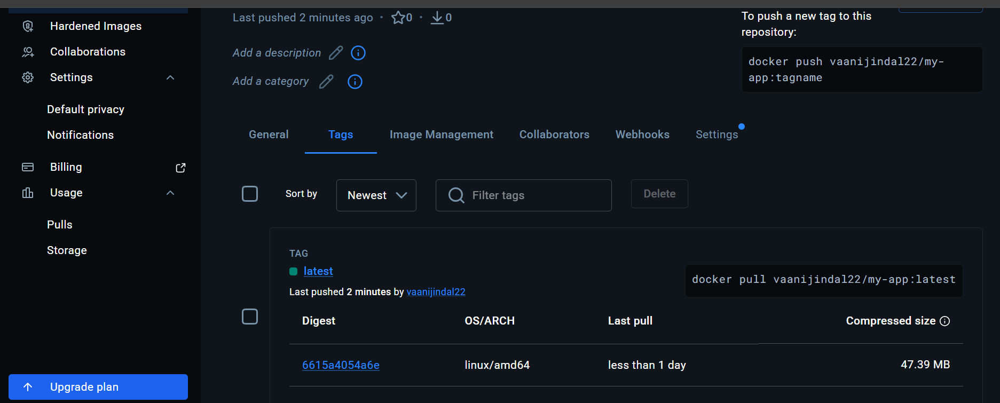

---

# Result

CI/CD pipeline was successfully implemented using Jenkins, Docker and GitHub.  
Application build and deployment process was automated successfully.

---

# Conclusion

The experiment successfully demonstrated implementation of CI/CD pipeline using Jenkins and Docker.  
Automation of build and deployment process improved efficiency and reduced manual effort.
