# EXPERIMENT 9 C&D

---

## Part A : ansible installations instructions:

### Step 1: Update System Packages
```bash
sudo apt update && sudo apt upgrade -y
```
📸 Screenshot:  
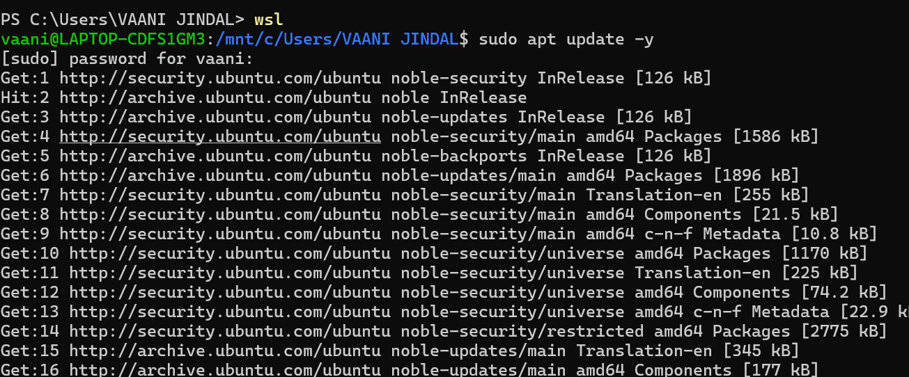

---

### Step 2: Install Ansible
```bash
sudo apt install ansible -y
```
📸 Screenshot:  
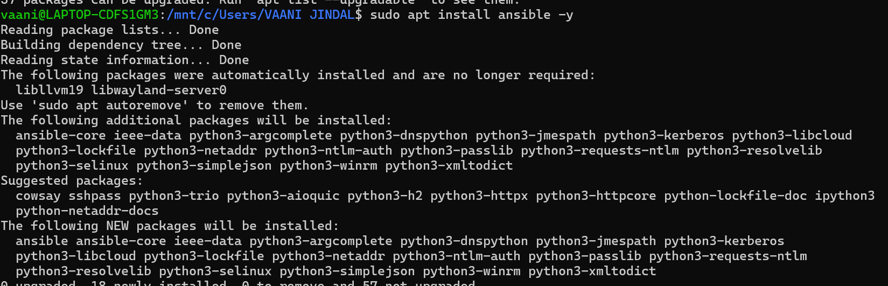

---

### Step 3: Verify Installation
```bash
ansible --version
```
📸 Screenshot:  
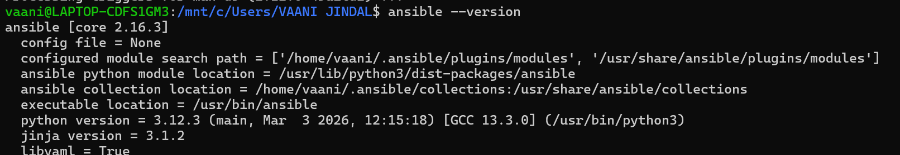

---

## post installation check :

### Ping Localhost
```bash
ansible localhost -m ping
```
📸 Screenshot:  
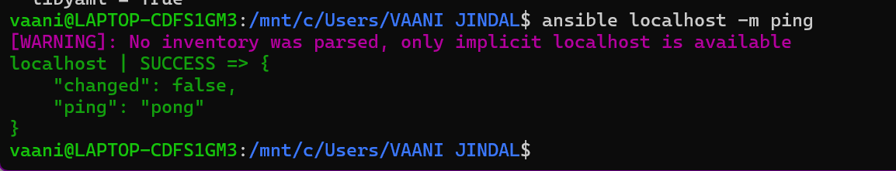

---

## Part B: Setup for Ansible with Docker (SSH Servers)

### 1. Create SSH Key Pair in WSL
```bash
ssh-keygen -t rsa
```
📸 Screenshot:  
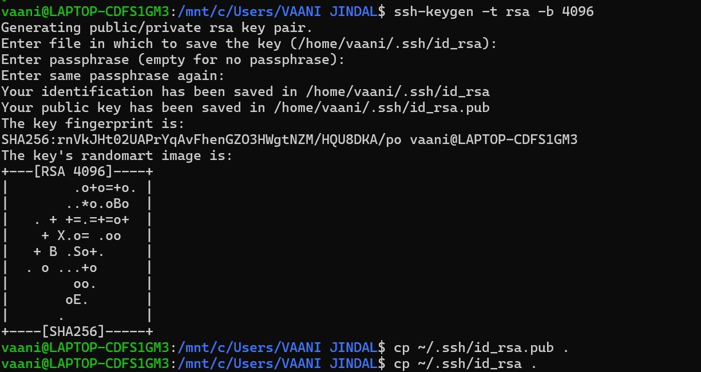

---

### Run Docker Containers (SSH Servers)
```bash
docker run -d -p 2222:22 --name server1 rastasheep/ubuntu-sshd
docker run -d -p 2223:22 --name server2 rastasheep/ubuntu-sshd
```
📸 Screenshot:  
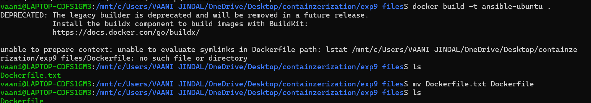

---

### Copy SSH Key to Containers
```bash
ssh-copy-id -p 2222 root@localhost
ssh-copy-id -p 2223 root@localhost
```
📸 Screenshot:  
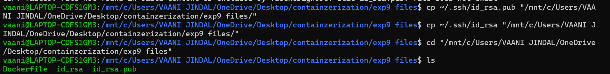

---

### Create Inventory File
```ini
[servers]
server1 ansible_host=127.0.0.1 ansible_port=2222 ansible_user=root
server2 ansible_host=127.0.0.1 ansible_port=2223 ansible_user=root
```
📸 Screenshot:  
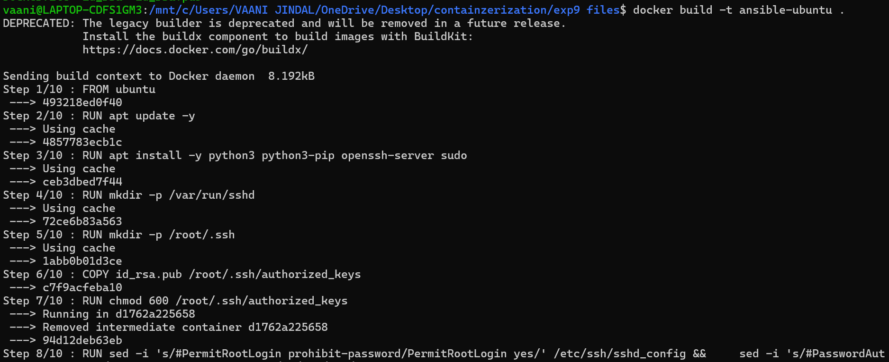

---

### Test Ansible Connectivity
```bash
ansible -i inventory.ini all -m ping
```
📸 Screenshot:  
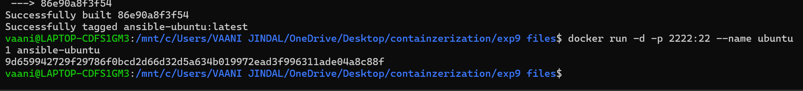

---

### Run Playbook
```bash
ansible-playbook -i inventory.ini playbook.yml
```
📸 Screenshot:  
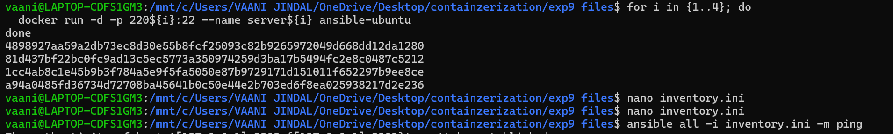

---

## (Multiple Servers + Ansible)

- Multiple Docker containers are used as managed nodes.
- Ansible connects via SSH using generated keys.
- Tasks are executed simultaneously across all servers.
- Ensures automation and scalability.

📸 Screenshot:  
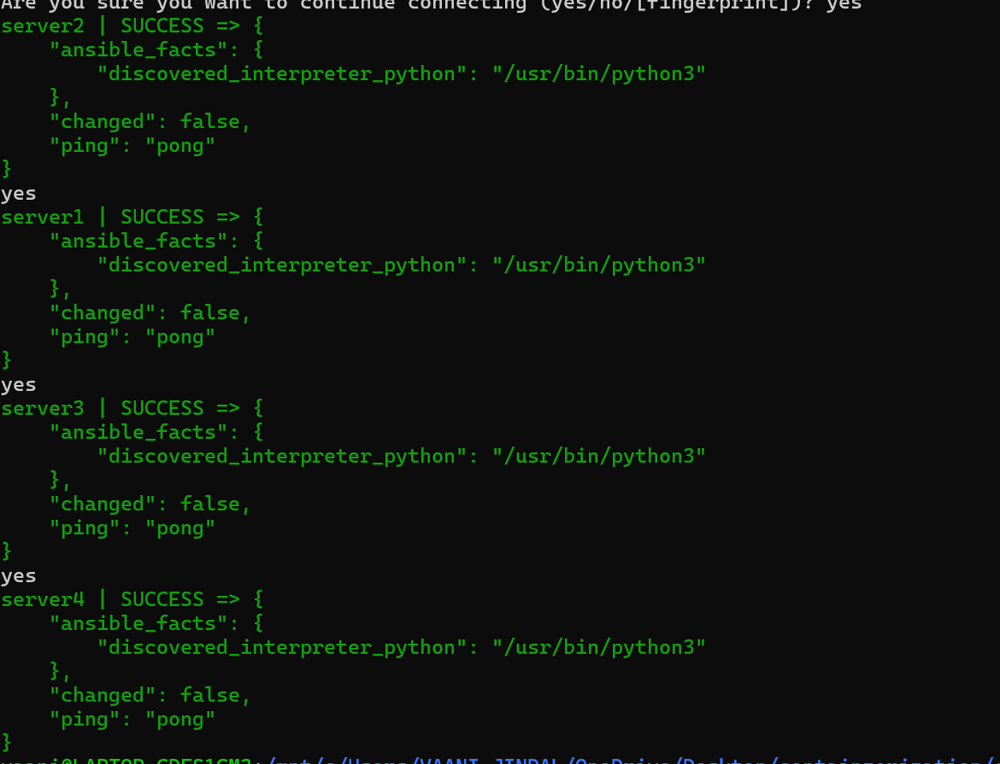
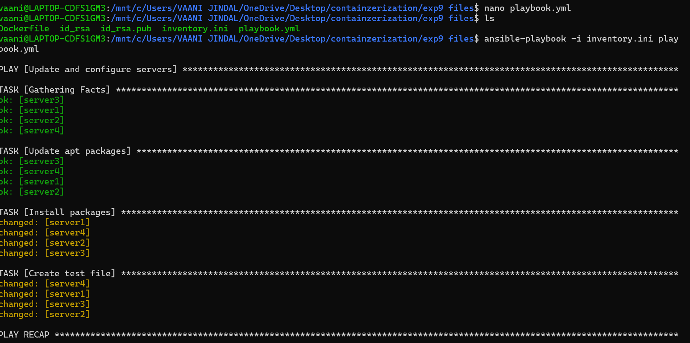
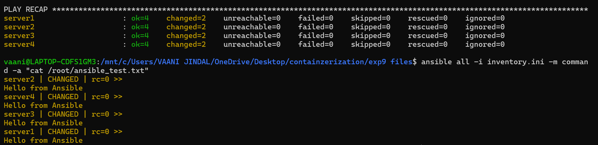
---


